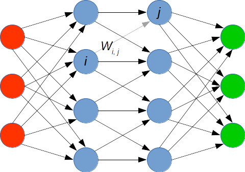

Feed Forward Neural Networks
============================

Feed Forward Neural Networks (FFNs) are simple networks of 'neurons' that
take an input, propagate it through some hidden layers
and give you an output for each individual class you specify.

The topology we use for this is the following:

| input                                  | hidden #1 | hidden #2 | output                         |
|----------------------------------------|-----------|-----------|--------------------------------|
| 10 (as many as we have numeric inputs) |       100 |       100 | 6 (as many as we have classes) |

